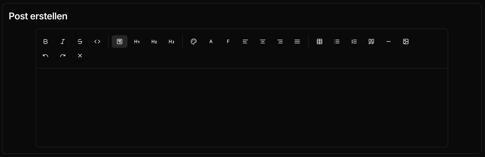
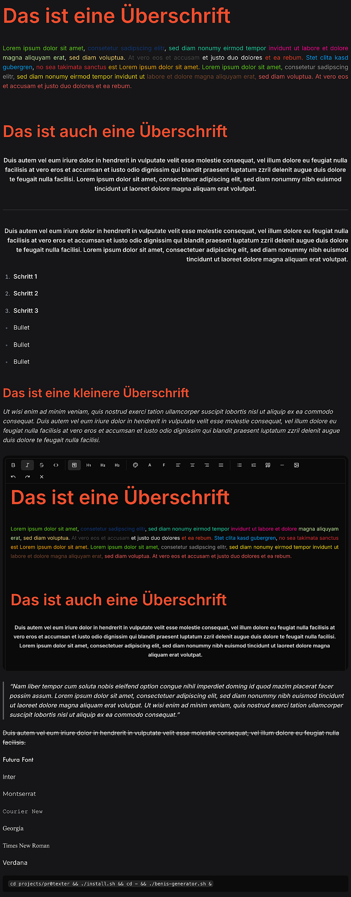

# pr0texter - Create OC Images for pr0gramm

A modern editor for creating high-quality posts for pr0gramm.

## Features

- Comprehensive rich text editor with TipTap
- Real-time preview of your posts
- Automatic saving of your work in the browser
- Instant download of your finished posts as images
- pr0gramm color palette for stylish designs
- Formatting Options
- Text formatting (Bold, Italic, Underlined)
- Headings and paragraphs
- Numbered and unnumbered lists
- Various fonts
- Code blocks
- Tables
- Quotes
- Horizontal lines
- Undo/Redo function

## Technology

- Frontend: Vue 3 with TypeScript
- Backend: Laravel (PHP)
- Editor: TipTap
- Image generation: Puppeteer (server-side)
- Styling: Tailwind CSS

## How It Works

1. Write your post in the editor
2. The preview updates automatically
3. Download the finished image

All uploaded images are automatically deleted from the server after 2 hours.

## Roadmap

- More templates for different post types
- Template with selectable background image
- More customization options

## Contributing

This project is open source and contributions are welcome!

## License

Distributed under the AGPL-3.0 License. See [LICENSE](https://github.com/Tschucki/pr0texter/blob/main/LICENSE) for more
information.

## Authors

- **[Tschucki](https://github.com/Tschucki)** - _Maintainer_

## Screenshot of Result

